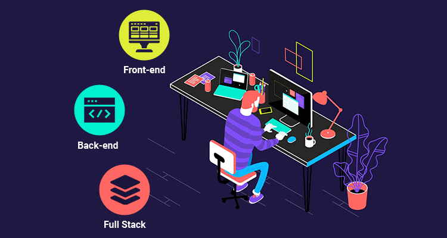

    

## 

**Greetings, Earthlings! I go by the name Sudip Lamichhane.
 
I am a full-stack developer from Nepal. Currently pursuing BCA at Birendra Multiple Campus, TU.**

<!--END_SECTION:mrepol742-->

 

   <h1 align="center">Ｔｅｃｈ Ｓｔａｃｋ</h1>

🕒 **Version Control**

## 🧠 Languages

---

## ⚙️ Frameworks / Libraries / Tools

---

## 💾 Databases

---

## ☁️ Hosting / SaaS

<!-- 
   <h1 align="center">Ｌｉｓｔｅｎ ｗｉｔｈ ｍｅ</h1>
   -->

 
<h1 align="center">Ｆｏｌｌｏｗ ｍｅ</h1>

 

